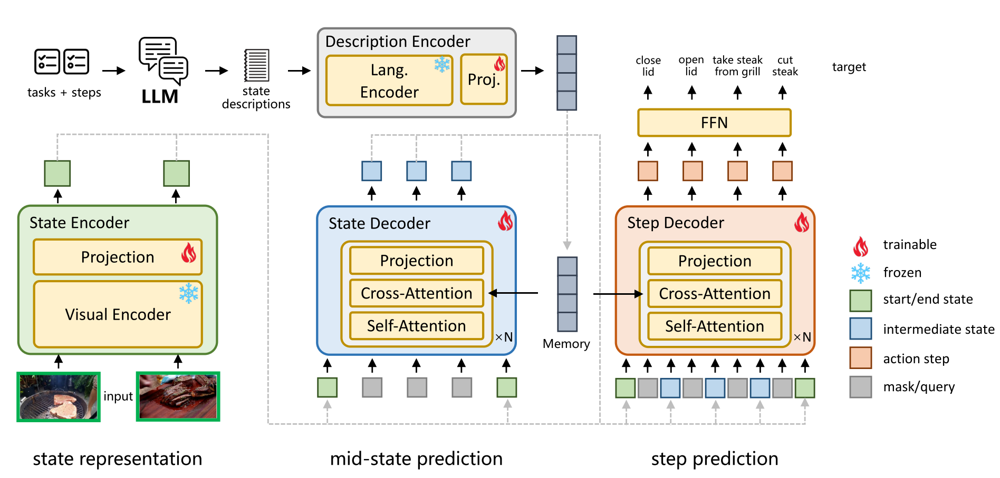

## SCHEMA: State CHangEs MAtter for Procedure Planning in Instructional Videos

[Yulei Niu](https://yuleiniu.github.io/), [Wenliang Guo](https://wenliangguo.github.io/), [Long Chen](https://zjuchenlong.github.io/), [Xudong Lin](https://xudonglinthu.github.io/), [Shih-fu Chang](https://www.ee.columbia.edu/~sfchang/)



**[[Paper]](https://arxiv.org/pdf/2403.01599.pdf)**

**Abstract**: We study the problem of procedure planning in instructional videos, which aims to make a goal-oriented sequence of action steps given partial visual state observations. The motivation of this problem is to learn a structured and plannable state and action space. Recent works succeeded in sequence modeling of steps with only sequence-level annotations accessible during training, which overlooked the roles of states in the procedures. In this work, we point out that State CHangEs MAtter (SCHEMA) for procedure planning in instructional videos. We aim to establish a more structured state space by investigating the causal relations between steps and states in procedures. Specifically, we explicitly represent each step as state changes and track the state changes in procedures. For step representation, we leveraged the commonsense knowledge in large language models (LLMs) to describe the state changes of steps via our designed chain-of-thought prompting. For state changes tracking, we align visual state observations with language state descriptions via cross-modal contrastive learning, and explicitly model the intermediate states of the procedure using LLM-generated state descriptions. Experiments on CrossTask, COIN, and NIV benchmark datasets demonstrate that our proposed SCHEMA model achieves state-of-the-art performance and obtains explainable visualizations.

## Environment Setup

Either creating manually:

```
conda create -n schema python==3.10.9
conda activate schema
conda install pytorch==1.13.1 torchvision==0.14. pytorch-cuda=11.6 -c pytorch -c nvidia
conda install tensorboardX==2.2 pandas==1.5.3 ftfy==5.8 regex==2022.7.9
pip install timm==0.6.13
```

Or using the provided .yaml file:

```
conda env create -f env.yaml
conda activate schema
```

## Data Preparation

### Dataset Info

|  Dataset  | Actions | Tasks | Observation Dim |
| :-------: | :-----: | :---: | :-------------: |
| CrossTask |   133   |  18  |       512       |
|   COIN   |   778   |  180  |       512       |
|    NIV    |   48   |   5   |       512       |

### Download Datasets

Download pre-extracted HowTo100M features

```
# CrossTask
bash scripts/download_crosstask.sh
# COIN
bash scripts/download_coin.sh
# NIV
bash scripts/download_niv.sh
```

### (Optional) Generate Descriptions

The descriptions of actions and states have been already provided in this repo. The raw descriptions are saved as .json files in the "data" folder. The state and action description features extracted by CLIP language encoder are saved respectively in the "data/state_description_features" and "data/action_description_features" folders.

If you want to customize the prompts and generate new descriptions, please follow the steps below:

1. Modify line 9 of *generate_descriptors.py*, set the variable *openai_key* to your OpenAI key.
2. Modify the prompt starting from line 25 of *generate_descriptors.py*.
3. Download OpenAI package and generate description files:

   ```
   pip install openai
   python generate_descriptors.py --dataset [DATASET]
   ```

   **Note: Replace the [DATASET] with a specific dataset: crosstask or coin or niv. (Same for the following steps)**
4. Extract description features:

   ```
   python extract_description_feature.py --dataset [DATASET]
   ```

## Train

```
bash scripts/run_{DATASET}.sh
```

With default setting, the checkpoint and running log are saved to the folder */logs*, and the best checkpoint is saved to the folder */checkpoints/{DATASET}*.

## Evaluation

```
bash scripts/eval_{DATASET}.sh
```

|                | Success Rate | Accuracy |  MIoU  |
| :-------------: | :----------: | :------: | :----: |
| CrossTask (T=3) |    31.83%    |  57.31%  | 78.33% |
| CrossTask (T=4) |    20.18%    |  51.86%  | 74.45% |
|   COIN (T=3)   |    32.37%    |  50.58%  | 84.11% |
|   COIN (T=4)   |    22.72%    |  45.74%  | 83.92% |
|    NIV (T=3)    |    27.93%    |  41.64%  | 76.77% |
|    NIV (T=4)    |    23.26%    |  39.93%  | 76.75% |

## (Optional) Change Dataloader

In this work, we followed the data pre-processing of [1] to curate and load datasets, and used the data-split of [2] to train and evaluate models. For comparison purposes, the dataloaders and data-splits of P3IV [3] and PDPP [4] are also provided in this repo. You can use them by simply setting the argument *split* to *pdpp* or *p3iv* in files *scripts/run_crosstask.sh* and *scripts/eval_crosstask.sh*.

[1] Chang, C. Y., Huang, D. A., Xu, D., Adeli, E., Fei-Fei, L., & Niebles, J. C. (2020, August). Procedure planning in instructional videos. In European Conference on Computer Vision (pp. 334-350). Cham: Springer International Publishing.
[2] Sun, J., Huang, D. A., Lu, B., Liu, Y. H., Zhou, B., & Garg, A. (2022). PlaTe: Visually-grounded planning with transformers in procedural tasks. IEEE Robotics and Automation Letters, 7(2), 4924-4930.
[3] Zhao, H., Hadji, I., Dvornik, N., Derpanis, K. G., Wildes, R. P., & Jepson, A. D. (2022). P3iv: Probabilistic procedure planning from instructional videos with weak supervision. In Proceedings of the IEEE/CVF Conference on Computer Vision and Pattern Recognition (pp. 2938-2948).
[4] Wang, H., Wu, Y., Guo, S., & Wang, L. (2023). Pdpp: Projected diffusion for procedure planning in instructional videos. In Proceedings of the IEEE/CVF Conference on Computer Vision and Pattern Recognition (pp. 14836-14845).

## Probabilistic (Uncertain) Modeling

```
# Train uncertain model
bash scripts/run_uncertain_crosstask.sh
```

For uncertain modeling, we initialized the input vectors of state decoder and action decoder with random noises. In contrast, zero input vectors were used for determinstic modeling.

```
# Evaulate uncertain model
bash scripts/eval_uncertain_crosstask.sh
```

You can modify the parameters *num_sample* (defalut 1500) in *eval_uncertain_crosstask.sh* to control the number of procedures generated by running the model multiple times. Each time the state decoder and step decoder take random noise vectors as input.

|   Prob Model   | Success Rate | Accuracy |  MIoU  | ModePrec | ModeRec | KL-Div | NLL |
| :-------------: | :----------: | :------: | :----: | :------: | :-----: | :----: | :--: |
| CrossTask (T=3) |    29.51%    |  57.09%  | 77.76% |  38.32  |  37.70  |  3.62  | 4.15 |
| CrossTask (T=4) |    16.55%    |  51.93%  | 74.42% |  26.46  |  23.76  |  3.82  | 4.62 |

## Citation

If you find our work helpful for your research, please consider citing the following BibTeX entry.

```
@article{niu2024schema,
  title={SCHEMA: State CHangEs MAtter for Procedure Planning in Instructional Videos},
  author={Niu, Yulei and Guo, Wenliang and Chen, Long and Lin, Xudong and Chang, Shih-Fu},
  journal={arXiv preprint arXiv:2403.01599},
  year={2024}
}
```
